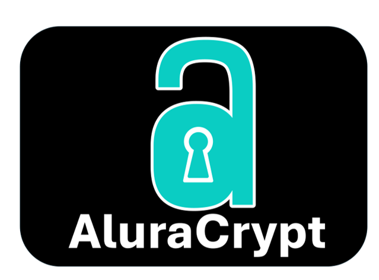
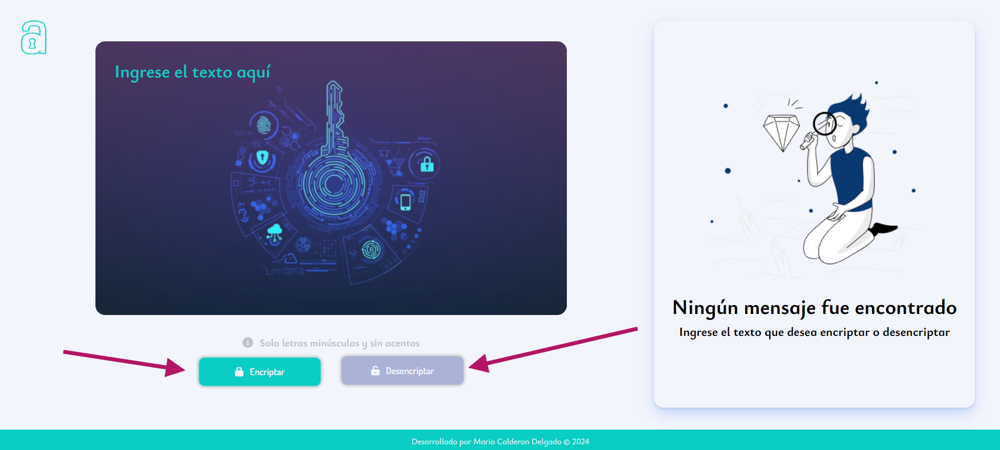
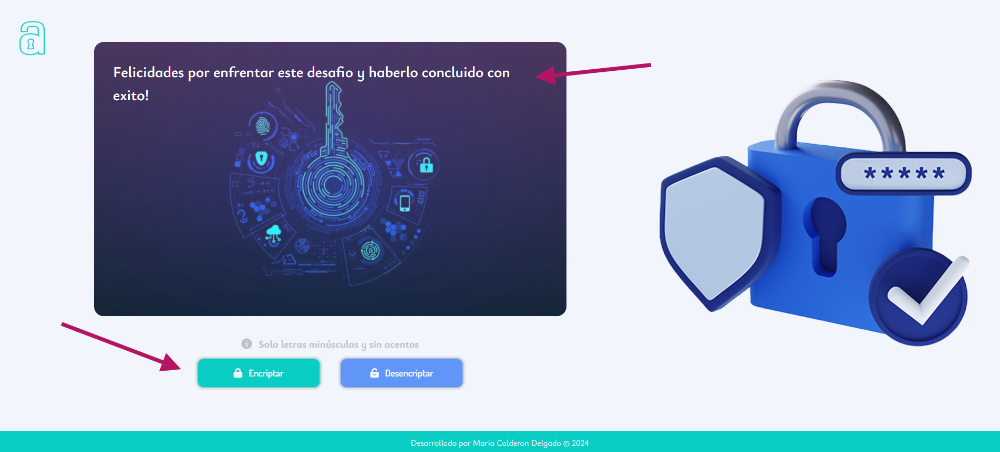
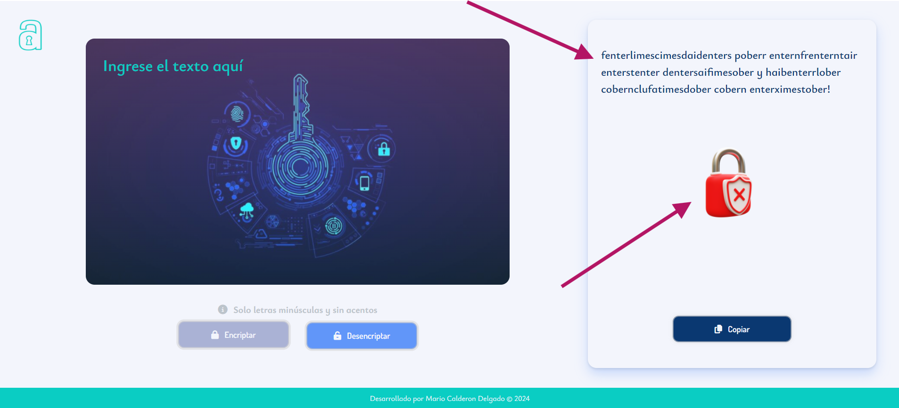
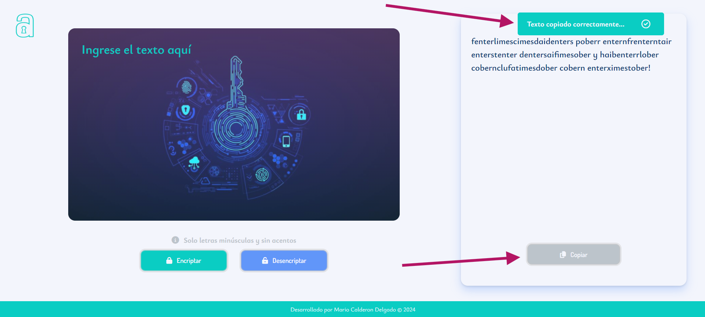
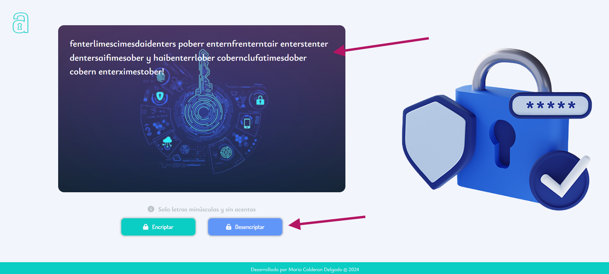

# Encriptador de Texto
### **Nombre**: AluraCript

AluraCript es una herramienta innovadora de encriptación y desencriptación de texto, diseñada para proporcionar seguridad y privacidad en la comunicación digital. Este proyecto, desarrollado como parte de un esfuerzo académico final para el; programa de **Oracle Next Education + Alura Latam**, este proyecto tiene como objetivo facilitar la protección de información de manera eficiente y accesible.





## Setup del proyecto
Para ejecutar **AluraCript** en tu máquina local, sigue estos pasos:

Requisitos Previos
- Un navegador web moderno

- Git para clonar el repositorio

Clonamos el proyecto

```bash
  git clone https://github.com/ariocal/EncriptadorDeTexto.git
```

Vamos a la carpeta del proyecto

```bash
  cd Encriptar-Desencriptar
```


Arrancamos en servidor local

```bash
  start index.html
```
Una vez que el archivo index.html esté abierto en tu navegador, podrás comenzar a utilizar AluraCript para encriptar y desencriptar texto.


## Autor

- [@ariocal](https://www.https://github.com/ariocal)


## Deployment

Todavia esta por determinar


## Tecnologias utilizadas

**HTML:** Estructura del contenido.

**CSS:** Estilos y diseño visual.

**JavaScript:** Lógica de la aplicación.

## Demostración de Uso

A continuación, te mostramos cómo usar **AluraCript** para encriptar y desencriptar texto.

1. **Abrir la aplicación**

   Abre el archivo `index.html` en tu navegador para iniciar la aplicación **AluraCript**.
   
2. **Mensajes no encontrados**
   
   Si usted intenta usar las opciones de encriptar o desencriptar el programa de indicara que debe ingresar el texto para poder procesarlo.
      
- ### Encriptación de Texto

1. **Ingresar texto**

   En la caja de texto principal, ingresa el texto que deseas encriptar y haga clic en el botón **"Encriptar"** para transformar tu texto en un formato seguro e ilegible..
     

2. **Ver el resultado encriptado**

   Una vez que el texto esté encriptado, aparecerá en el área designada(lado derecho de la pantalla) para mostrar el texto encriptado, al igual podra notar una candado que funciona de guia indicando que su texto fue encriptado.
   

3. **Uso del texto encriptado**

   Una vez que tengamos nuestro texto encriptado, podemos enviarlo como un texto seguro a nuestro destinatio. Para facilitar ello hemos añadido un **boton de copiar** para facilitar el uso del programa.
     

- ### Desencriptación de Texto

1. **Ingresar texto encriptado**
   Para desencriptar un texto debemos seguir mismos pasos que hicimos para encriptar nuestro texto, lo unico diferentes es que esta vez usaremos el **boton de desencriptar**
   Copiamos el texto densencriptar y pégalo en la caja de texto principal, y como ya menciamos seguimos los pasos anteriores.
   

## Responsibidad
AluraCript está hecho para funcionar perfectamente en cualquier dispositivo. Ya sea que uses un teléfono móvil, una tableta o una computadora de escritorio, la aplicación se adapta al tamaño de tu pantalla. Esto significa que puedes encriptar y desencriptar texto fácilmente, sin importar el dispositivo que tengas a mano.
 

## Licencia
[](https://choosealicense.com/licenses/mit/)

